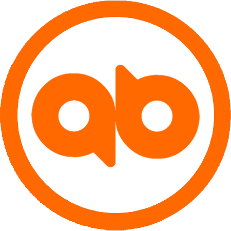

# Allbot OS
`AN OPERATING SYSTEM`

Allbot is an AI Dapp & protocol emulator built in Quarkonium system to satisfy the supplies and demands in the cyberspace.

## Introduction

Coming soon ...

## Miscellaneous

Project collaboration extends from teamwork, coalition, partnership, etc. to spontaneous cooperation among virtual units.

### Allbot Lab
Allbot Lab, a team of Quarkonium Foundation, pioneers the development of the core systems, organizes the ecosystem communications, maintains the collaboration among communities, approves and supports any significant roadmap.

### Communities & Collaboration
- Social networking systems
- RPG Gaming societies
- Cryptonomic societies
- Blockchain societies
- [Algobet Labs](http://algobet.org/allbot) &middot; [Github](https://github.com/allbot) &middot; [Gitlab](https://gitlab.com/allbot)

### Contact
- Website: http://a.algobet.org
- Slack: allbot.slack.com
- Email: allbot@algobet.org

### Logos & Copyrights
- Logo:  
- Copyright: &copy; 2018 Allbot, An Algobet Labs Project

